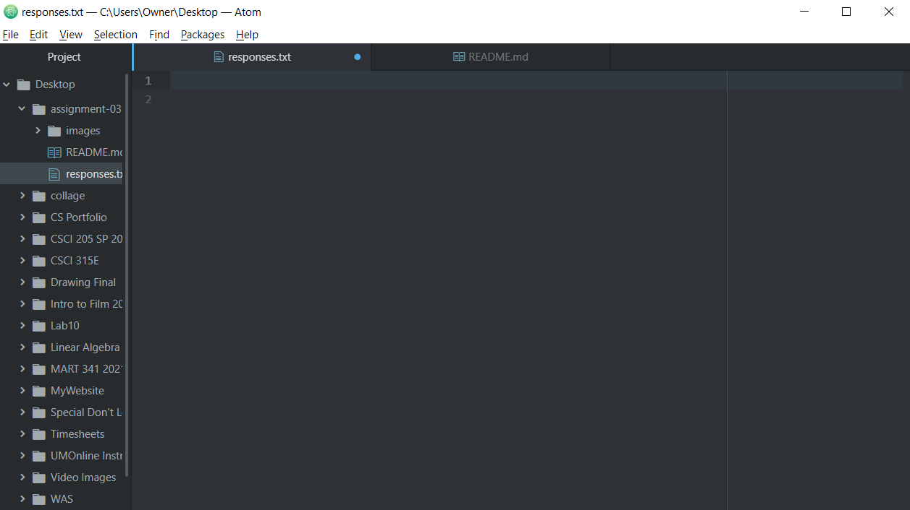

# Assignment 3
## Shea Gerard
1. How the internet works
2. How to use GitHub
3. How domain names and IP addresses works

I visit [YouTube](https://www.youtube.com/) frequently.

Here is my [responses.txt](./responses.txt) file.

