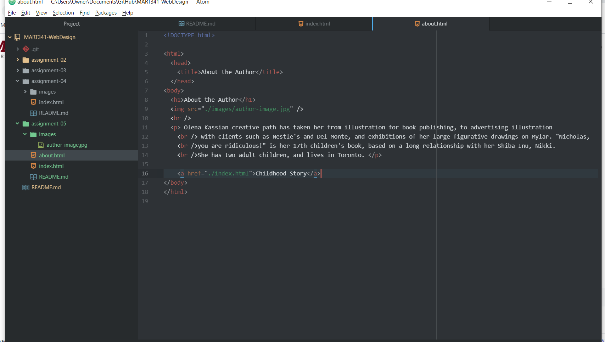

1. Using The Wayback Machine, I visited youtube.com in 2009. It was surprising to see how different it looked. It has a lot less features and looks a bit more difficult to navigate. It doesn't look like there was an option to subscribe and I wonder if their algorithm for showing users videos was as advanced as it is today.

2. This week I learned more about linking in html. It was interesting to learn how to link multiple pages of a website so users can navigate between them. I felt like the information was easy to learn.

3. 
